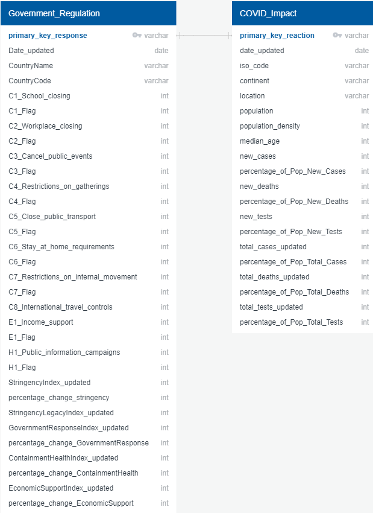

# Capstone Project on COVID-19
*the following is my specific section of our group capstone project for the Data Analytics Bootcamp run through the University of Toronto School of Continuing Studies.

For the full project, please click [here](https://github.com/pmmfs)

## Overview
Our group (Martin Kaminskyj, Sami Elkhayri, Muzznah Ansari, Femi Adeleke, and Patricia Lan) chose to perform data analysis on coronavirus disease of 2019 (COVID-19). The topic of COVID-19 was chosen because it is a current, global issue with extensive socioeconomic impact, and public data is available. Thus, many approaches to analysis are possible. 

This project evaluates government measures to contain the spread of COVID-19, starting from January 1, 2020 to August 31, 2020. The dataset from Oxford university's Blavatnik School of Government contained indices that categorized government responses to COVID-19 and Our World in Data provided medical data on COVID-19 (e.g. number of confirmed cases and deaths).

The question the project hoped to answer was: 

1) Government measures - Which stringency measures are associated with lower rate of increase of total cases? Total deaths?
   
## Analysis
To view the code used to analyse the correlation between the timing and severity of each countries initial stringency efforts and their outcome of total cases and deaths as a percentage of population, visit the [analysis_gov_regulation_impact directory](analysis_gov_regulation_impact).

## Database 
Data was stored in a SQLite database ([covid_db.db](analysis_gov_regulation_impact/Resources/covid_db.db)) to be queried for input into machine learning models. Figure 1 shows an entity relationship diagram (ERD) of the database.

#### Figure 1. Database ERD

## Software
See [Technology.md](Technology.md) for a description of the technologies, languages, tools, and algorithms used in this project.

## Dashboard
[---need to update---](---need to update---) to view the dashboard. Files used to create the dashboard are available in the [---need to update---](---need to update---). 

## Resources

### Data
- [owid-covid-data(Aug31,2020).csv](analysis_gov_regulation_impact/Resources/raw/owid-covid-data(Aug31,2020).csv) (Our World in Data - COVID-19 database)
- [OxCGRT_latest(Aug31,2020).csv](analysis_gov_regulation_impact/Resources/raw/OxCGRT_latest(Aug31,2020).csv) (University of Oxford - COVID-19 Government Response Tracker)

### Software
See [Technology.md](Technology.md)
