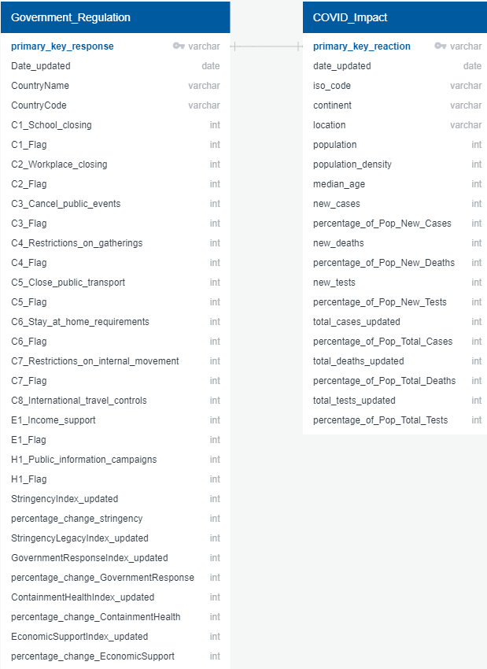

# Capstone Project on COVID-19
**the following is my specific section of our group capstone project for the Data Analytics Bootcamp run through the University of Toronto School of Continuing Studies.*

*For the full project, please [click here](https://github.com/pmmfs)*

## Overview
Our group (Femi Adeleke, Muzznah Ansari, Sami Elkhayri, Martin Kaminskyj, and Patricia Lan) chose to perform data analysis on coronavirus disease of 2019 (COVID-19). The topic of COVID-19 was chosen because it is a current, global issue with extensive socioeconomic impact, and public data is available. Thus, many approaches to analysis are possible. 

This project evaluates government measures to contain the spread of COVID-19, starting from January 1, 2020 to August 31, 2020. The dataset from Oxford university's Blavatnik School of Government contained indices that categorized government responses to COVID-19 and Our World in Data provided medical data on COVID-19 (e.g. number of confirmed cases and deaths).

The question I was trying to answer was: 

1) Is there a relationship between each countries initial stringency ramp up period (the time it takes for each government to implement their most stringent policies - based on Stringency Index) and the related number of total cases and total deaths as a percentage of population.

### Background

To compare government responses between countries, Oxford University created an index ("government response index" (GR)) that rated government responses on a scale of 0 to 100. An index of zero meant no measures, whereas 100 meant that the most aggressive measures, relative to all countries, were employed.

The GR index was an aggregate of the indices stringency, health/containment, and economic support. These indices rated government responses by their respective categories (e.g. stringency), also on a scale of 0 to 100. Each index grouped similar government measures. For example, stringency (i.e. behavioural restrictions) includes: school closures, workplace closures, cancellations of public events, restrictions on gathering, public transport closures, stay at home requirements, restrictions on internal movement, and international travel controls.

## Dashboard
[Click here](https://martinkaminskyj.github.io/covid-19_capstone_project/) to view the dashboard.
   
## Analysis
To view the code used to clean the raw data and analyse the correlation between each countries stringency ramp  up period and their outcome of total cases and deaths as a percentage of population, visit the [Analysis folder](Analysis).

## Database 
Data was stored in a SQLite database ([covid_db.db](Analysis/Resources/covid_db.db)) to be queried for input for future analyses. Figure 1 shows an entity relationship diagram (ERD) of the database.

#### Figure 1. Database ERD

## Resources

### Data
- [owid-covid-data(Aug31,2020).csv](Analysis/Resources/raw/owid-covid-data(Aug31,2020).csv) (Our World in Data - COVID-19 database)
- [OxCGRT_latest(Aug31,2020).csv](Analysis/Resources/raw/OxCGRT_latest(Aug31,2020).csv) (University of Oxford - COVID-19 Government Response Tracker)

### Software
See [Technology.md](Technology.md)
